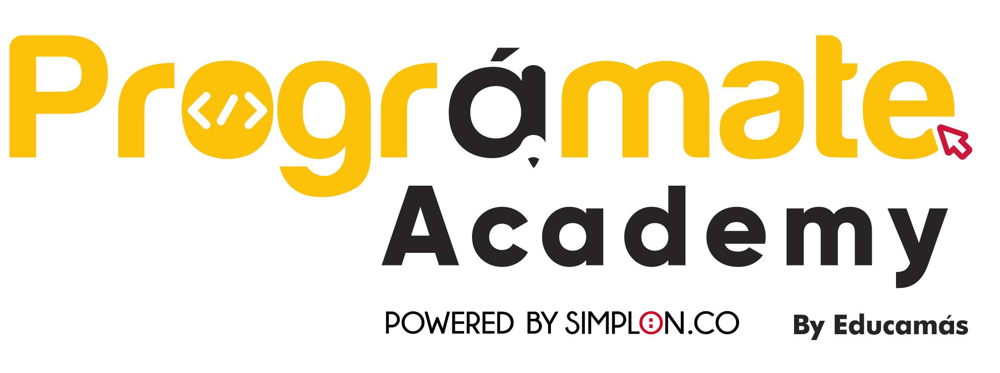

# Clase Asyncronismo y Promesas

## Descripción

Este mini proyecto nos ayuda a entender el asyncronismo y el manejo de las promesas

## Documentación de la API

https://icanhazdadjoke.com/api

## Tecnologías utilizadas

- JS
- CSS
- HTML
- Fetch

## Instalación

1. Clona este repositorio en tu máquina local:

## Uso

1. Abre el archivo index.html en el navegador de tu preferencia.
2. Completa el archivo main.js siguiendo la documentación de la API. 

## Contacto

Si tienes alguna pregunta o sugerencia o quieres el workbook para desarrollar este proyecto, no dudes en contactarme en [jsanchez@educamas.com.co](jsanchez@educamas.com.co).

# await
